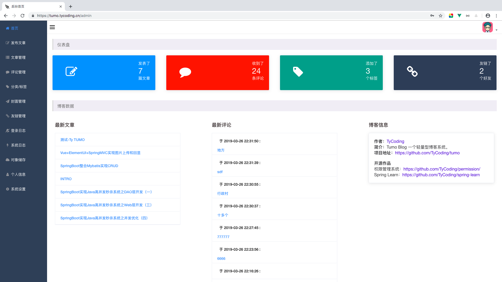
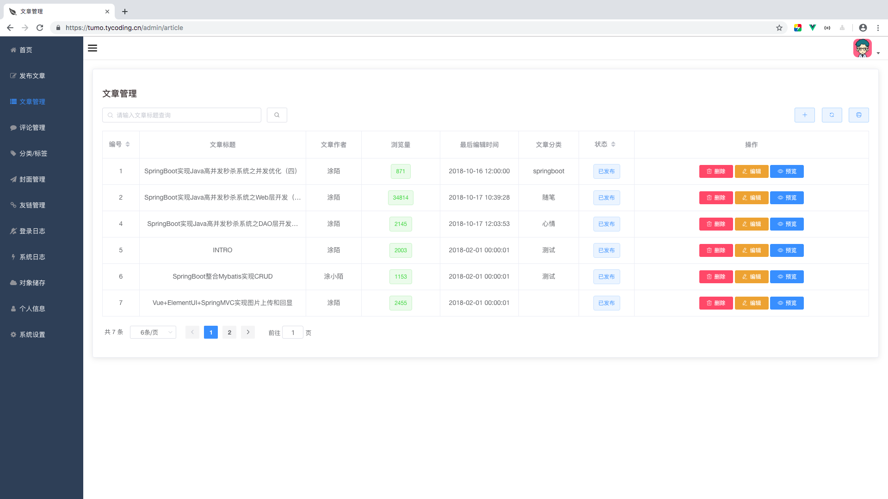
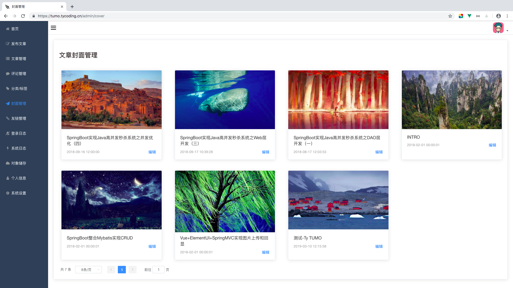
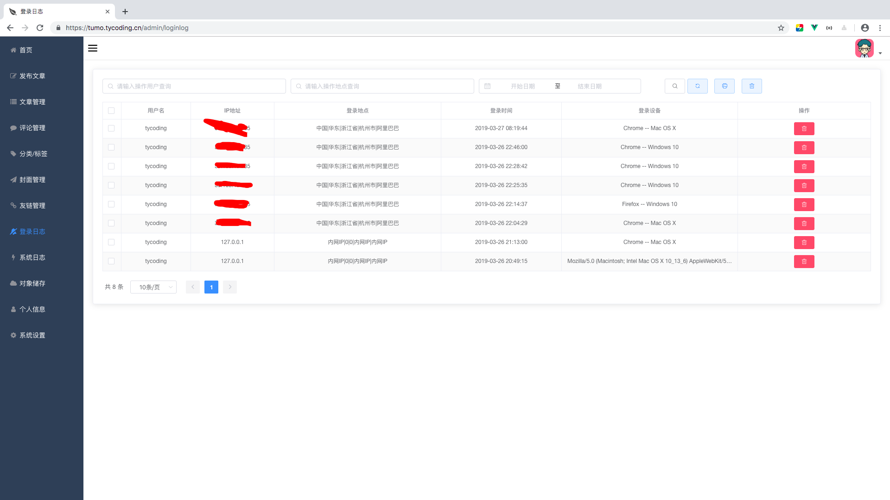
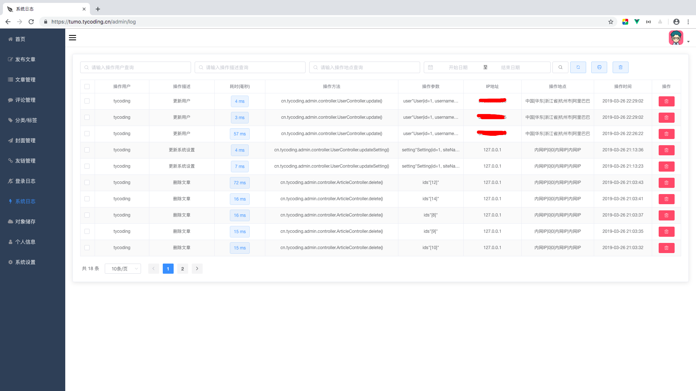
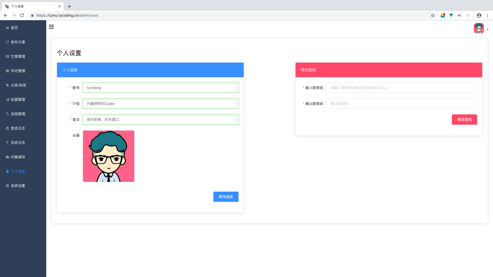
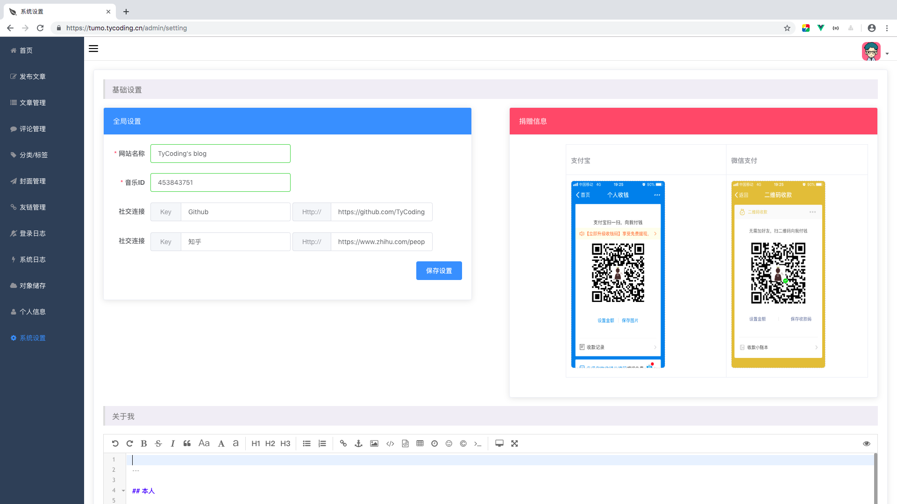

# Tumo Blog

> 更漂亮的博客系统，更丰富的功能，更愉快的体验！

Tumo Blog是一个基于SpringBoot2开发的博客系统。博客前台UI移植自[@pinghsu](https://github.com/chakhsu/pinghsu)主题，因为原主题是基于PHP的，所以我不能直接使用它，但是非常感谢[@pinghsu](https://github.com/chakhsu/pinghsu)的作者。
Tumo Blog的后台管理页面基于ElementUI绘制，后台管理通过ajax异步交互，相当于前后端半分离吧。如果你觉得它不错，欢迎 star fork。

注意：本博客系统仍在不断的维护开发中，欢迎提出合理的建议。当前系统适合正在学习SSM&&SpringBoot框架的同学。陆续，我会发布基于Vue、Angular（node.js）的前后端完全分离的版本，如果你喜欢，请持续关注了(#^.^#)。

演示站点: [http://tumo.tycoding.cn](http://tumo.tycoding.cn)

[快速开始](https://github.com/TyCoding/tumo/wiki/%E5%A6%82%E4%BD%95%E9%83%A8%E7%BD%B2Tumo-Blog)

## Vue版本

本博客也有基于Vue组件开发的前后端完全分离的版本，如果你已经熟悉的传统的SSM框架开发模式，或许你可以尝试一下前后端分离的开发模式，那么 [https://github.com/TyCoding/tumo-vue](https://github.com/TyCoding/tumo-vue)就是一个不错的选择。

同时也欢迎大家借此项目进行二次开发。详细介绍请看：[https://github.com/TyCoding/tumo-vue](https://github.com/TyCoding/tumo-vue)

如果大家喜欢、或是对大家的学习有所帮助，请点击右上角star、fork 给作者一些鼓励。

### 链接

项目地址：[TyCoding/tumo-vue](https://github.com/TyCoding/tumo-vue)
预览站点：[tumo-vue.tycoding.cn](http://tumo-vue.tycoding.cn/)
后台地址：[tumo-vue.tycoding.cn/login](http://tumo-vue.tycoding.cn/login)

## 技术选型

### 后端

* 基础框架：Spring Boot 2.1.3.RELEASE

* 持久层框架：Mybatis 1.3.1

* 安全框架：Shiro

* 模板引擎：Thymeleaf 3.0.11.RELEASE

* 其他：Druid、PageHelper、AOP、

### 前端

* 基础框架：ElementUI

* JavaScript框架：Vue.js

### 开发环境

* 语言： JDK1.8

* IDE： IDEA 2018.3

* 依赖管理： Maven

* 数据库： Mysql 5.7.24

## 写在前面

如上，前端完全依赖Vue.js，这和传统依赖Jquery的前端区别还是蛮大的，使用Vue即要用基于Node.js的前后端分离的开发模式，而本项目中仅仅是在HTML中引入了vue.js，虽然不是完全的前后端分离开发，但项目中我尽量使用Vue.js渲染数据，涉及后端的也仅是用到Thymeleaf的`th:replace`拼接页面。看下图：

# 特点

* 简约的设计，漂亮的界面。
* 博客前台、管理后台响应式设计。
* 支持Markdown格式文章的撰写。
* 支持文件上传。
* 支持网易云音乐定制。
* 项目后端管理页面基于Vue.js和ElementUI设计，避免繁琐的DOM操作。
* 登录日志记录，IP、地理位置等。
* 个性化社交设置。
* 更多功能正在开发中...

# 快速开始

Tumo Blog是一个基于SpringBoot-2.x框架的博客系统。如果你已经熟悉SSM框架，部署这个项目将是非常简单的。更多的信息，请看：

- [x]  [1.如何部署Tumo Blog](https://github.com/TyCoding/tumo/wiki/%E5%A6%82%E4%BD%95%E9%83%A8%E7%BD%B2Tumo-Blog)

# 预览

**演示站点:** [tumo.tycoding.cn](http://tumo.tycoding.cn)

**Github:** [tumo](https://github.com/TyCoding/tumo)

**Blog:** [tycoding.cn](http://tycoding.cn)

初始账户：tycoding  密码：123456

## 预览图

**响应式：**

更多预览请部署后查看
